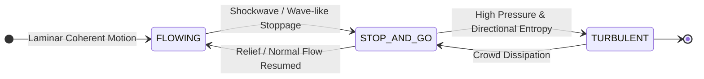
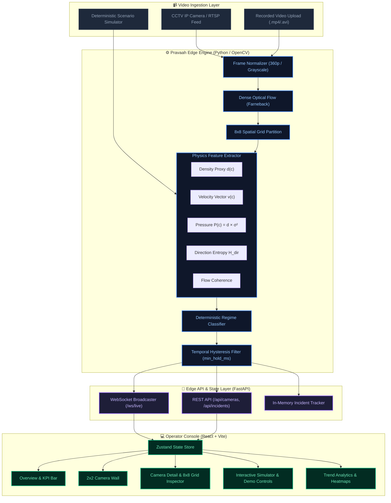
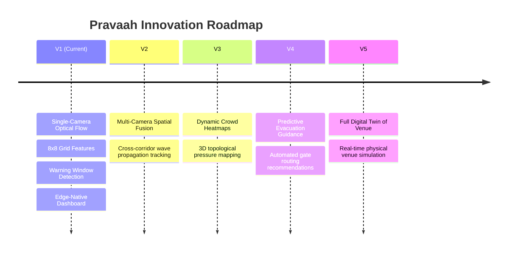

# 🌊 PRAVAAH (प्रवाह)
## Real-Time Crowd Movement Intelligence & Crush Prevention

[](https://python.org)
[](https://fastapi.tiangolo.com)
[](https://opencv.org)
[](https://reactjs.org)
[](https://www.typescriptlang.org)
[](https://tailwindcss.com)
[](https://vitejs.dev)
[](LICENSE)

> ### 📢 **DETECT EARLY. ACT EARLY. PREVENT THE CRUSH.**
>
> *Pravaah is a privacy-first, edge-native crowd safety system that shifts the paradigm from headcounts to fluid motion physics. By continuously analyzing optical flow coherence, Pravaah detects invisible crowd shockwaves minutes before dangerous turbulence occurs.*

---

## 👥 Project & Team

**Team Name:** `Quartz Visualz`

**Members:**
- **Satyam Kumar**
- **Ishika**
- **Manik**

---

## 📑 Table of Contents

1. [Executive Summary](#-executive-summary)
2. [The Problem: Why Density Fails](#-the-problem-why-density-fails)
3. [The Insight & The Warning Window](#-the-insight--the-warning-window)
4. [Core Concept: Fluid Dynamics over Counting](#-core-concept-fluid-dynamics-over-counting)
5. [Regime Classification Matrix](#-regime-classification-matrix)
6. [System Architecture & End-to-End Pipeline](#-system-architecture--end-to-end-pipeline)
7. [Mathematical Formulations & Physics Signals](#-mathematical-formulations--physics-signals)
8. [Deterministic Core: Why No Black-Box AI in the Critical Path](#-deterministic-core-why-no-black-box-ai-in-the-critical-path)
9. [Privacy-First & Zero-PII Guarantee](#-privacy-first--zero-pii-guarantee)
10. [Edge-Native Architecture](#-edge-native-architecture)
11. [Operator Dashboard & Visual UI](#-operator-dashboard--visual-ui)
12. [Deterministic Scenario Simulator](#-deterministic-scenario-simulator)
13. [Technology Stack](#-technology-stack)
14. [Repository Structure](#-repository-structure)
15. [Quick Start & Local Development](#-quick-start--local-development)
16. [Acceptance Criteria & Verification](#-acceptance-criteria--verification)
17. [Future Roadmap (V2 - V5)](#-future-roadmap)
18. [Closing Statement](#-closing-statement)

---

## 📌 Executive Summary

Pravaah is a real-time crowd movement intelligence system designed to detect dangerous crowd dynamics **before** a crowd crush occurs.

Unlike traditional crowd monitoring systems that rely primarily on headcounts or density estimation, Pravaah focuses on **movement behavior**.

The system continuously analyzes crowd flow using dense optical flow and spatial movement-field analysis to classify crowd behavior into three distinct physical regimes:

```text
FLOWING
   ↓
STOP-AND-GO  <--- [ CRITICAL INTERVENTION WINDOW ]
   ↓
TURBULENT
```

The transition from **`FLOWING`** to **`STOP-AND-GO`** provides the critical intervention window where control room operators can still act (e.g., opening diversion gates, metering turnstiles, deploying marshals).

### Built for Real-World Deployment
* 📹 **Works on existing CCTV infrastructure** (no specialized sensors required).
* 🔒 **Zero facial recognition or identity tracking** (100% privacy-preserving).
* ⚡ **100% On-premise edge execution** (operates flawlessly without internet access).
* 💻 **Runs on low-cost edge hardware** (efficient C++/Python OpenCV vectorization).

---

## 🚨 The Problem: Why Density Fails

A dense crowd is **not necessarily a dangerous crowd**.

```text
Metro Platform      -->  Dense + Safe (Orderly boarding)
Temple Queue        -->  Dense + Safe (Controlled progression)
Festival Entrance   -->  Dense + Safe (Uni-directional flow)
```

Most existing crowd monitoring solutions trigger alerts based on **raw density thresholds**.

```text
Density Threshold Crossed  ===>  🚨 False Alarm
Density Threshold Crossed  ===>  🚨 False Alarm
Density Threshold Crossed  ===>  🚨 False Alarm
Density Threshold Crossed  ===>  🚨 False Alarm
```

**The consequence:** Operators suffer from alert fatigue and stop trusting the system. Worse, dangerous counter-flows at moderate density go completely undetected until physical compression begins.

> ### 🔑 **The Real Signal**
> The true precursor to crowd disasters is not density alone.
>
> **The real signal is the breakdown of coherent movement.**

---

## 💡 The Insight & The Warning Window

Extensive fluid-dynamic research into historic crowd disasters reveals a universal progression:

```text
Normal Flow  ───►  Stop-And-Go Waves  ───►  Turbulent Motion  ───►  Crowd Crush
```

Stop-and-go waves (intermittent stop-start shockwaves propagating backward through a crowd) **emerge 2 to 5 minutes before turbulence**.

This is the **Intervention Window**. Pravaah is mathematically calibrated to detect that exact phase transition.

```text
Crowd Energy & Disorder
  ^
  |                                                  CRITICAL TURBULENCE
  |                                                /------------------- (Disaster)
  |                                 STOP-AND-GO   /
  |                                /------------/
  |                  FLOWING      /  [ WARNING WINDOW ]
  |             /----------------/   2-5 Minutes for Operators
  |            /                     to Divert & Relieve Flow
  |           /
  +----------+--------------------+-------------+----------------------> Time
          t = 0s               t = 30s       t = 90s               t = 150s
        [Normal Flow]       [Early Waves]  [Intervene Now]        [Chaos]
```

---

## 🧭 Core Concept: Fluid Dynamics over Counting

Instead of counting individual persons:

```text
❌ Head Count Estimation
❌ Face Detection / Landmarks
❌ Identity Tracking / Re-ID
❌ Bounding Box Trackers
```

Pravaah measures the fluid kinematics of the crowd:

```text
✓ Velocity Vector Fields (u, v)
✓ Kinetic Pressure (Density × Velocity Variance)
✓ Spatial Motion Variance
✓ Directional Shannon Entropy
✓ Global Flow Coherence
```

---

## 📊 Regime Classification Matrix

Pravaah partitions each video frame into an $8 \times 8$ grid and continuously tracks local and global motion vectors.



---

### 1. 🟢 FLOWING (Safe)

**Characteristics:**
* People move coherently in a uniform direction.
* Direction entropy: **Low** ($< 0.40$)
* Velocity variance: **Low**
* Kinetic pressure: **Low** ($< 0.35$)

**Vector Field Visualization:**
```text
→ → → → → →
→ → → → → →
→ → → → → →
```

**Operational Status:** `SAFE` — Nominal operations. No intervention required.

---

### 2. 🟡 STOP-AND-GO (Warning Window)

**Characteristics:**
* Movement shockwaves appear; forward motion becomes intermittent.
* Forward motion temporarily stalls, creating localized compression waves.
* Kinetic pressure and directional variance rise sharply.
* Direction entropy: **Medium** ($0.40 - 0.70$)
* Kinetic pressure: **Medium** ($0.35 - 0.70$)

**Vector Field Visualization:**
```text
→ → →  → →
→  ←  →  →
→ → →  ← →
```

**Operational Status:** `WARNING` — **Actionable Window.** Dispatch marshals, throttle incoming corridors, open auxiliary exit gates.

---

### 3. 🔴 TURBULENT (Critical Risk)

**Characteristics:**
* Movement becomes completely chaotic and multi-directional.
* People are pushed by force waves rather than walking under personal control.
* Extreme kinetic pressure; near-zero flow coherence.
* Direction entropy: **High** ($> 0.70$)
* Kinetic pressure: **High** ($> 0.70$)

**Vector Field Visualization:**
```text
↗ ↓ ↙ ←
↑ ↘ → ↖
↙ ↑ ↗ ↓
```

**Operational Status:** `CRITICAL` — Immediate emergency protocol execution to prevent crush injuries.

---

## 🏗️ System Architecture & End-to-End Pipeline

```text
                 CCTV / Video Stream
                          │
                          ▼
                 Frame Acquisition (360p)
                          │
                          ▼
                 Optical Flow Engine (Farneback)
                          │
                          ▼
                Motion Vector Field (u, v)
                          │
                          ▼
             Grid Cell Partitioning (8x8 Grid)
                          │
         ┌────────────────┼────────────────┐
         ▼                ▼                ▼
      Density          Velocity         Entropy
      d(c)             v_u, v_v         H_dir(c)
         ▼                ▼                ▼
         └────────────────┬────────────────┘
                          │
                          ▼
                 Pressure Calculation
             P(c) = d(c) × Var(Velocity)
                          │
                          ▼
                Regime Classification
             (FLOWING | STOP_GO | TURB)
                          │
                          ▼
              Hysteresis / Anti-Flicker Filter
             (Candidate -> Min Hold -> Commit)
                          │
                          ▼
                    Alert Generator
                          │
                          ▼
                 FastAPI + WebSocket (/ws/live @ 5Hz)
                          │
                          ▼
            Operator Dashboard (React + TypeScript)
```



---

## 📐 Mathematical Formulations & Physics Signals

Pravaah partitions each camera frame into an $8 \times 8 = 64$ spatial cell matrix. For each cell $c$, five pure physical signals are extracted:

```
+---+---+---+---+---+---+---+---+
|0,0|0,1|0,2|0,3|0,4|0,5|0,6|0,7|   Each cell computes:
+---+---+---+---+---+---+---+---+   • Density Proxy: d(c)
|1,0|1,1|1,2|1,3|1,4|1,5|1,6|1,7|   • Velocity Vector: v_u(c), v_v(c)
+---+---+---+---+---+---+---+---+   • Velocity Variance: σ_v^2(c)
|...|   |   |   |   |   |   |...|   • Pressure: P(c) = d(c) × σ_v^2(c)
+---+---+---+---+---+---+---+---+   • Direction Entropy: H_dir(c)
|7,0|7,1|7,2|7,3|7,4|7,5|7,6|7,7|   • Cell Regime: FLOWING | STOP_GO | TURB
+---+---+---+---+---+---+---+---+
```

### 1. Density Proxy ($d_c$)
Calculates the spatial ratio of moving pixels inside cell $c$:
$$d_c = \frac{1}{|c|} \sum_{(x,y) \in c} \mathbb{I}(\|\vec{u}(x,y)\| > \tau_{\text{noise}})$$
*Where $\tau_{\text{noise}} = 0.5\text{ px/frame}$ suppresses camera sensor noise.*

### 2. Velocity Magnitude & Vectors ($\vec{v}_c$)
Normalized velocity vector representing dominant cell motion:
$$\bar{u}_c = \frac{1}{|c_{\text{active}}|} \sum_{(x,y) \in c} u(x,y), \quad \bar{v}_c = \frac{1}{|c_{\text{active}}|} \sum_{(x,y) \in c} v(x,y)$$
$$\|\vec{v}_c\| = \sqrt{\bar{u}_c^2 + \bar{v}_c^2}$$

### 3. Kinetic Pressure ($P_c$)
The core physical precursor to crowd crush. High density combined with high velocity variance represents conflicting force waves:
$$\sigma_{v, c}^2 = \frac{1}{|c_{\text{active}}|} \sum_{(x,y) \in c} \left( \|\vec{u}(x,y)\| - \|\vec{v}_c\| \right)^2$$
$$P_c = \text{clip}\left( \frac{d_c \times \sigma_{v, c}^2}{P_{\text{norm\_scale}}}, 0.0, 1.0 \right)$$

### 4. Directional Shannon Entropy ($H_c$)
Measures the directional disorder of flow vectors across $K = 8$ angular bins $[-\pi, \pi]$:
$$\theta(x,y) = \text{atan2}(v(x,y), u(x,y))$$
$$p_k = \frac{\text{Count}(\theta \in \text{bin}_k)}{\sum_j \text{Count}(\theta \in \text{bin}_j)}$$
$$H_c = -\frac{1}{\ln K} \sum_{k=1}^{K} p_k \ln(p_k + \epsilon) \quad \in [0.0, 1.0]$$

### 5. Global Flow Coherence
$$\text{Coherence} = 1.0 - H_{\text{aggregate}}$$

---

## 🧠 Deterministic Core: Why No Black-Box AI in the Critical Path

Most modern crowd safety pitches propose:

```text
Video Frame  ───►  Heavy Deep Learning Model  ───►  Black-Box Prediction
```

**Why Pravaah rejected this approach:**
1. **Opaque Hallucinations:** Deep learning models cannot explain *why* an alert was fired to an on-site safety commander.
2. **Heavy GPU Requirements:** Unfeasible for cost-effective deployment across dozens of local venue cameras.
3. **Training Data Bias:** Real-world crowd crush footage is rare; models fail on unseen lighting, weather, or crowd demographics.

**Pravaah's Deterministic Approach:**

```text
Video Frame  ───►  Optical Flow  ───►  Fluid Physics Metrics  ───►  Deterministic Classification
```

* **100% Explainable:** Every alert links directly to exact entropy spikes and pressure formulas.
* **Audit-Proof:** Replaying the same video produces identical mathematical outputs every single time.
* **Ultra-Fast:** Runs at 30+ FPS on standard CPU hardware without GPU acceleration.

---

## 🔒 Privacy-First & Zero-PII Guarantee

Pravaah treats the crowd strictly as a **continuous macroscopic fluid**.

```text
❌ ZERO Face Recognition or Landmark Detection
❌ ZERO Person Tracking or Re-Identification
❌ ZERO Demographic, Gender, or Emotion Inference
❌ ZERO Cloud Video Storage or Transmission
```

Only aggregate optical motion vectors ($u, v$) are computed in volatile RAM buffers and immediately discarded after feature extraction. No personal identifiable information (PII) is ever created or stored.

---

## 🌐 Edge-Native Architecture

Pravaah is engineered for environments with constrained or completely severed internet connectivity:

```text
[ CCTV Cameras ] ──► [ Local Switch ] ──► [ Edge PC / Server ] ──► [ Operator Dashboard ]
                                                 │
                                           (No Internet
                                             Required)
```

**Target Deployment Venues:**
* 🛕 **Temples & Pilgrimage Gatherings** (Kumbh Mela, Tirupati, Vaishno Devi)
* 🚆 **Railway & Metro Transit Hubs** (Suburban platforms, transfer corridors)
* 🏟️ **Stadiums & Arenas** (Concourse exits, turnstile bottlenecks)
* 🎪 **Music Festivals & Public Rallies** (Entry gates, stage barriers)

---

## 💻 Operator Dashboard & Visual UI

The dashboard uses a dark operations-center aesthetic built for rapid situational awareness:

```
+-----------------------------------------------------------------------------------------------+
|  🌊 PRAVAAH OPERATIONS CONSOLE             [ LIVE EDGE: NODE-01 ] [ DEMO SCENARIOS ] 12:45:00 |
+-----------------------------------------------------------------------------------------------+
| [NAVIGATION]   |  OVERVIEW METRICS                                                            |
|                |  +------------------+ +------------------+ +------------------+ +----------+ |
| 📊 Overview    |  | Active Cams: 06  | | Flowing: 04 🟢   | | Stop & Go: 01 🟡 | | Turb: 01🔴 | |
| 📺 Live Wall   |  +------------------+ +------------------+ +------------------+ +----------+ |
| 🎮 Simulator   |                                                                              |
| 📷 Cameras     |  LIVE CAMERA GRID (2x2 / Responsive Wall)                                    |
| 🚨 Incidents   |  +-------------------------------+  +-------------------------------+        |
| 📈 Analytics   |  | CAM-01 [Main Gate]    FLOWING |  | CAM-02 [Platform A]   STOP_GO |        |
| ⚙️ System      |  | [ Density: 0.28 | Press: 0.12]|  | [ Density: 0.68 | Press: 0.54]|        |
|                |  +-------------------------------+  +-------------------------------+        |
|                |  +-------------------------------+  +-------------------------------+        |
|                |  | CAM-03 [Fest Gate]  TURBULENT |  | CAM-04 [Exit Corridor]FLOWING |        |
|                |  | [ Density: 0.89 | Press: 0.82]|  | [ Density: 0.15 | Press: 0.08]|        |
|                |  +-------------------------------+  +-------------------------------+        |
+-----------------------------------------------------------------------------------------------+
```

### Camera Detail & $8 \times 8$ Grid Inspector

```
+-----------------------------------------------------------------------------------------------+
| CAM-03: FESTIVAL GATE (PRIMARY DEMO CAMERA)                          STATUS: 🔴 TURBULENT     |
+-------------------------------------------------------------+---------------------------------+
| VIDEO OVERLAY & 8x8 GRID TENSOR HEATMAP                     | TELEMETRY & WARNING WINDOW      |
|                                                             |                                 |
|  [ 🟢 ][ 🟢 ][ 🟢 ][ 🟡 ][ 🟡 ][ 🟢 ][ 🟢 ][ 🟢 ]           | Risk Level: CRITICAL            |
|  [ 🟢 ][ 🟢 ][ 🟡 ][ 🔴 ][ 🔴 ][ 🟡 ][ 🟢 ][ 🟢 ]           | Warning Window: 00:00 (Active)  |
|  [ 🟢 ][ 🟡 ][ 🔴 ][ 🔴 ][ 🔴 ][ 🔴 ][ 🟡 ][ 🟢 ]           | Density Proxy: 0.88             |
|  [ 🟢 ][ 🟡 ][ 🔴 ][ 🔴 ][ 🔴 ][ 🔴 ][ 🟡 ][ 🟢 ]           | Velocity Mean: 0.42 m/s         |
|  [ 🟢 ][ 🟢 ][ 🟡 ][ 🔴 ][ 🔴 ][ 🟡 ][ 🟢 ][ 🟢 ]           | Direction Entropy: 0.84         |
|  [ 🟢 ][ 🟢 ][ 🟢 ][ 🟡 ][ 🟡 ][ 🟢 ][ 🟢 ][ 🟢 ]           | Flow Coherence: 0.16            |
|  [ 🟢 ][ 🟢 ][ 🟢 ][ 🟢 ][ 🟢 ][ 🟢 ][ 🟢 ][ 🟢 ]           |                                 |
|  [ 🟢 ][ 🟢 ][ 🟢 ][ 🟢 ][ 🟢 ][ 🟢 ][ 🟢 ][ 🟢 ]           | RECOMMENDED ACTIONS:            |
|                                                             | [ SIMULATE GATE 4 OPEN ]        |
|  LEGEND: 🟢 Flowing (<0.35)  🟡 Stop&Go (0.35-0.70)  🔴 Turb (>0.70)  [ DISPATCH MARSHALS ]   |
+-------------------------------------------------------------+---------------------------------+
| HISTORICAL TREND (LAST 60 SECONDS)                                                            |
| Pressure:    ~~~____/‾‾‾‾‾\______________________/\/\/\‾‾‾‾‾‾‾‾‾‾‾‾‾‾                         |
| Entropy:     ____---/‾‾‾‾‾\_____________________--/‾‾‾‾‾‾‾‾‾‾‾‾‾‾‾‾‾‾                         |
+-----------------------------------------------------------------------------------------------+
```

---

## 🎮 Deterministic Scenario Simulator

For repeatable demonstrations, regression testing, and operator training, Pravaah embeds 5 deterministic crowd scenarios:

```mermaid
gantt
    title Simulator Scenario Timeline: "festival_gate"
    dateFormat  ss
    axisFormat  %S sec

    section Flow Phase
    Stable Laminar Flow (FLOWING)      :active, a1, 00, 15s
    
    section Warning Window
    Queue Compression (STOP_AND_GO)   :crit, a2, after a1, 20s
    Warning Window Countdown Active   :crit, a3, after a1, 20s
    
    section Critical Turbulence
    Turbulent Multi-vector Surge      :crit, a4, after a2, 20s
    
    section Recovery
    Dispersal & Gate Relief (FLOWING) :active, a5, after a4, 15s
```



| Scenario ID | Name | Core Dynamics Simulated | Progression |
| :--- | :--- | :--- | :--- |
| `normal_flow` | **Normal Corridors** | Stable laminar motion, uniform direction, stable velocity | `FLOWING` |
| `platform_bottleneck` | **Metro Platform A** | Throttle bottleneck, intermittent wave compression | `FLOWING` $\to$ `STOP_AND_GO` |
| `counter_flow` | **Bidirectional Crossing** | Opposing stream collision, severe directional entropy | `FLOWING` $\to$ `STOP_AND_GO` $\to$ `TURBULENT` |
| `festival_gate` | **Festival Main Gate** | Funnel compression, queue surges, extreme kinetic pressure | `FLOWING` $\to$ `STOP_AND_GO` $\to$ `TURBULENT` $\to$ `FLOWING` |
| `exit_compression` | **Emergency Exit** | Spatial pinch point, velocity collapse at barrier | `FLOWING` $\to$ `STOP_AND_GO` $\to$ `TURBULENT` |

---

## 🛠️ Technology Stack

| Layer | Technologies | Role |
| :--- | :--- | :--- |
| **Edge Engine** | Python 3.10+, OpenCV, NumPy, SciPy | Dense optical flow, grid feature tensors, hysteresis |
| **API & Broadcast** | FastAPI, WebSockets, Uvicorn, Pydantic v2 | High-throughput 5 Hz event streaming, REST API |
| **Operator Console** | React 18, TypeScript, Vite, TailwindCSS | Real-time operations center UI, dark mode theme |
| **State & Charts** | Zustand, Recharts, Lucide React, Framer Motion | Low-latency state management, vector visualizations |
| **Quality & Tests** | Pytest, Vitest, ESLint, TypeScript Strict | Contract testing, invariant tests, anti-flicker tests |

---

## 📂 Repository Structure

```text
pravaah/
├── engine/                      # Python OpenCV & FastAPI Edge Backend
│   ├── app/
│   │   ├── classifier.py        # Deterministic regime classification rules
│   │   ├── config.py            # Global thresholds, grid sizes, hold timers
│   │   ├── features.py          # Pure mathematical feature extractors
│   │   ├── hysteresis.py        # Anti-flicker temporal state stabilizer
│   │   ├── main.py              # FastAPI server, REST routes, background tasks
│   │   ├── schemas.py           # Pydantic v2 data models & WS payloads
│   │   ├── video_adapter.py     # Frame extraction & optical flow runner
│   │   ├── warning_window.py    # Warning window estimator
│   │   └── ws.py                # WebSocket connection manager
│   ├── tests/                   # Pytest suite (Unit, Integration, Contract)
│   ├── requirements.txt         # Python pinned dependencies
│   └── Procfile                 # Process runner definition
│
├── dashboard/                   # React + TypeScript + Vite Frontend
│   ├── src/
│   │   ├── components/          # GridVisualization, MetricBar, Layout
│   │   ├── pages/               # Overview, LiveMonitoring, CameraDetail, Analytics, System
│   │   ├── store/               # Zustand real-time event store
│   │   ├── types/               # TypeScript interfaces (1:1 with Engine schemas)
│   │   ├── App.tsx              # React router configuration
│   │   └── main.tsx             # Application entry point
│   ├── package.json             # NPM dependencies & scripts
│   └── vite.config.ts           # Vite bundler configuration
│
├── simulator/                   # Synthetic scenario definitions & mocks
├── footage/                     # Sample CCTV video clips for demo analysis
└── specs/                       # Master architectural specifications & ADRs
```

---

## 🚀 Quick Start & Local Development

### Prerequisites
* **Python 3.10+**
* **Node.js 18+** & **npm 9+**

---

### Step 1: Start the Edge Engine (FastAPI Backend)

```bash
cd engine

# Create and activate virtual environment
python3 -m venv venv
source venv/bin/activate  # On Windows: venv\Scripts\activate

# Install dependencies
pip install -r requirements.txt

# Start the FastAPI engine on port 8000
python3 -m uvicorn app.main:app --host 0.0.0.0 --port 8000 --reload
```

* Backend API: `http://localhost:8000`  
* Interactive Swagger Docs: `http://localhost:8000/docs`

---

### Step 2: Start the Operator Dashboard (React Frontend)

Open a new terminal:

```bash
cd dashboard

# Install dependencies
npm install

# Start Vite dev server
npm run dev
```

* Open `http://localhost:5173` in your browser.

---

## ✅ Acceptance Criteria & Verification

Pravaah satisfies all core acceptance criteria:

- [x] **Dashboard Launches:** React + Vite interface loads cleanly with zero console errors.
- [x] **Engine Launches:** FastAPI server boots with healthy `/health` status and loaded camera metadata.
- [x] **WebSocket Live Stream:** Live bidirectional `/ws/live` connection streaming updates at 5 Hz.
- [x] **Simulator Replay:** All 5 deterministic scenarios replay with exact timestamps and transitions.
- [x] **Flowing State Detected:** Coherent laminar flow correctly classified as `FLOWING` 🟢.
- [x] **Stop-and-Go Detected:** Compression shockwaves detected with active **Warning Window** timer 🟡.
- [x] **Turbulent State Detected:** High entropy/pressure conditions immediately flagged as `TURBULENT` 🔴.
- [x] **Zero Flicker Hysteresis:** State transitions stabilized via `min_hold_ms` temporal debouncing.
- [x] **Offline Edge Operation:** Zero external network requests required for critical inference.

---

## 🗺️ Future Roadmap



* **V2 — Multi-Camera Spatial Fusion:** Correlate shockwave propagation across sequential corridor cameras.
* **V3 — Crowd Density Heatmaps:** Integrated topological pressure projection over 3D venue floorplans.
* **V4 — Predictive Evacuation Guidance:** Real-time AI advisory suggesting optimal gate opening sequences to relieve pressure.
* **V5 — Digital Twin of Venue:** Real-time synchronized digital twin for large-scale municipal control centers.

---

## 💬 Closing Statement

> **Pravaah does not predict disasters.**  
> **It detects the warning signs already visible in crowd movement and turns them into actionable intelligence.**

---

<div align="center">
  <h3>DETECT EARLY. ACT EARLY. PREVENT THE CRUSH.</h3>
  <sub>Developed by <b>Team Quartz Visualz</b> • Pravaah Crowd Intelligence © 2026</sub>
</div>
